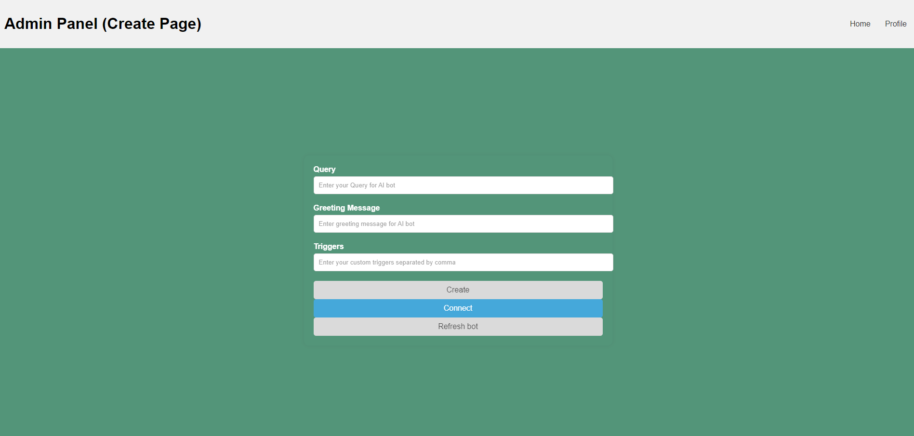

# AI-sales

## Table of Contents

1. [Project Description](#project-description)
2. [Features](#features)
3. [Demo](#demo)
4. [Installation](#installation)
6. [How to use](#usage)
7. [Technologies Used](#technologies-used)

## Project Description
This project is designed to assist sales representatives in efficiently managing their customer interactions via WhatsApp. The WhatsApp Bot automates responses, tracks customer queries, and streamlines communication, enabling sales teams to focus on closing deals and enhancing customer relationships. The bot's responses are based on data about the products being sold, which is provided by the seller.

## Features

1. **Automated responses**: The bot can provide instant replies to common customer inquiries, ensuring prompt communication.
2. **Customer Query Tracking**: All customer interactions are logged and tracked, making it easy to follow up on leads and maintain a history of conversations.
3. **Triggers**: The bot can be configured with custom triggers to automate specific actions based on keywords or phrases in customer messages. These actions include sending a message to a Telegram channel for sellers with information about the encountered trigger and the customer (in progress).
4. **Product Data Integration**: Bot responses are tailored based on the product data provided by the seller, ensuring accurate and relevant information is shared with customers (in progress).
5. **Bot Customization**: The bot's behavior, greeting message, and triggers can be customized to meet the specific needs of different sales teams and products.

## Demo

[Watch the Demo Video](https://drive.google.com/drive/home).

1. Main page for customizing a chatbot. User can add queries, custom triggers and define greeting nessage.

  

2. The Refresh Page allows the bot to resume interaction with a customer after encountering a trigger. When the bot detects a trigger in the conversation, it sends a default message and stops responding to the customer. By using the Refresh Page, sellers can re-enable the bot's functionality for that particular customer, ensuring continuous and effective communication.

  

## Installation

### 1. Environment Setup

Ensure you have access to the following resources before starting:

- **Firebase**: API key, authentication domain, and database URL.
- **WhatsAppBot**: Instance ID and API token for API interaction.
- **Gemini**: API key for Gemini model access.
- **Vertex AI**: Vertex AI project ID for integration.
- **Google Cloud**: Client ID, client secret, credentials, and other necessary parameters.

### 2. Install Dependencies

1. Make sure you have the following installed:

- Node.js
- npm (Node Package Manager)
- Docker

2. Clone the repository:

```bash
git clone https://gitlab.pg.innopolis.university/d.ryazanov/inno-whatsapp-interns.git
```

3. To install the required dependencies, run:

```bash
npm install
# or
yarn install
```

### 3. Configure API Keys

Locate the existing `.env` file in the `api` directory of your project and update the following environment variables:

```plaintext
# Firebase
API_KEY="YOUR_FIREBASE_API_KEY"
AUTH_DOMAIN="YOUR_FIREBASE_AUTH_DOMAIN"
DATABASE_URL="YOUR_FIREBASE_DATABASE_URL"
PROJECT_ID="YOUR_FIREBASE_PROJECT_ID"
STORAGE_BUCKET="YOUR_FIREBASE_STORAGE_BUCKET"
MESSAGING_SENDER_ID="YOUR_FIREBASE_MESSAGING_SENDER_ID"
APP_ID="YOUR_FIREBASE_APP_ID"
MEASUREMENT_ID="YOUR_FIREBASE_MEASUREMENT_ID"

# WhatsAppBot
BOT_INSTANCE_ID="YOUR_WHATSAPPBOT_INSTANCE_ID"
BOT_API_TOKEN_INSTANCE="YOUR_WHATSAPPBOT_API_TOKEN_INSTANCE"

# Gemini
API_KEY_GEMINI="YOUR_GEMINI_API_KEY"
GEMINI_MODEL="gemini-pro"

# Vertex AI
VERTEX_AI_PROJECT_ID="YOUR_VERTEX_AI_PROJECT_ID"

# Google Cloud
GCLOUD_CLIENT_ID="YOUR_GCLOUD_CLIENT_ID"
GCLOUD_PROJECT_ID="YOUR_GCLOUD_PROJECT_ID"
GCLOUD_AUTH_URI="https://accounts.google.com/o/oauth2/auth"
GCLOUD_TOKEN_URI="https://oauth2.googleapis.com/token"
GCLOUD_AUTH_PROVIDER_CERT_URL="https://www.googleapis.com/oauth2/v1/certs"
GCLOUD_CLIENT_SECRET="YOUR_GCLOUD_CLIENT_SECRET"
REDIRECT_URIS=["http://localhost"]
GOOGLE_APPLICATION_CREDENTIALS="/path/to/your/google-credit.json"
```

Replace YOUR_* with your actual API keys and IDs. If any variables are missing, add them to your .env file.

### 4. Obtaining API Keys

1. **Firebase**

1. Go to the Firebase Console.
2. Create a new project or select an existing project.
3. Navigate to Project Settings and locate your Firebase configuration.
4. Copy the necessary keys and add them to your .env file.

2. **Gemini API**

1. Sign up for the Gemini API service.
2. Generate your API key and model identifier.
3. Add these values to your .env file under API_KEY_GEMINI and GEMINI_MODEL.

3. **Google Cloud**

1. Go to the Google Cloud Console.
2. Create a new project or select an existing project.
3. Navigate to APIs & Services > Credentials.
4. Create a new OAuth 2.0 Client ID and download the JSON file.
5. Add the values from the JSON file to your .env file under the respective fields.

4. **Bot Configuration**

- Create a WhatsApp Bot:

    1. Log in to your GreenAPI account.
    2. Navigate to the section for creating new projects or bots.
    3. Create a new project and select the WhatsApp bot option.

- Obtain BOT_INSTANCE_ID and BOT_API_TOKEN_INSTANCE:

    1. After creating the project, you will be provided with a unique instance ID and API token.
    2. You can find these details in the settings section of your project or on the dashboard.

### 5. Running the application

1. Start the development server:

```bash
npm start
```

2. Build for production:

```bash
npm run build
```

3. Run with Docker:

```bash
docker-compose up --build
```

The admin panel is accessible at: http://localhost:3000

## How to Use

Step-by-step instructions on how to use your AI-sales.

1. Step one
2. Step two
3. Step three 

## Technologies Used

-  **React:** JavaScript library for building user interfaces.
-  **Node.js:** JavaScript runtime built on Chrome's V8 JavaScript engine.
-  **Firebase:** Backend as a Service (BaaS) platform by Google.
-  **Docker:** Platform for building, shipping, and running applications in containers.


